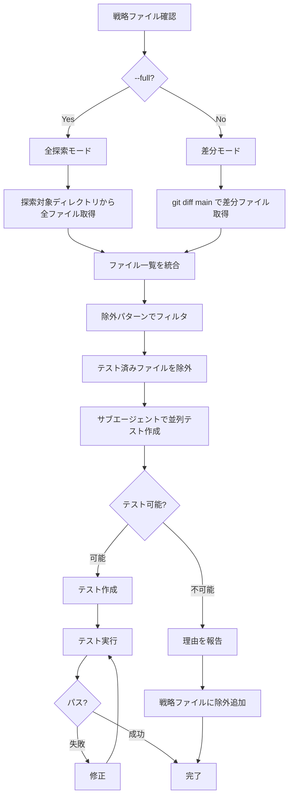

# Test Lib

ライブラリ・ユーティリティの単体テストを作成・実行・修正する。

メインエージェントは司令塔として動作し、実際の作業はサブエージェントに委任する。


## 引数

- `--full` - 全探索モード (探索対象ディレクトリ内の全ファイルを対象)
- 引数なし - 差分モード (main ブランチとの差分ファイルのみ対象)


## フロー図




## 準備: 戦略ファイルを確認

最初に `.claude/strategies/test-lib.md` を確認する。

ファイルが存在しない場合は、コードベースを探索して作成する。

戦略ファイルには以下が定義されている:

- 探索対象ディレクトリ
- 除外パターン


## フェーズ1: ファイル一覧を取得


### 差分モード (デフォルト)

main ブランチとの差分ファイルを取得する。

```bash
git diff --name-only main -- '*.ts' | grep -v '\.test\.ts$' | grep -v '\.d\.ts$'
```

取得したファイルのうち、戦略ファイルの探索対象ディレクトリに含まれるもののみを対象とする。


### 全探索モード (--full)

探索対象ディレクトリごとにサブエージェント (Explore) を並列起動する。

各サブエージェントへの指示:

```
指定ディレクトリ内の全 .ts ファイルを列挙する。
除外: *.test.ts, *.d.ts, index.ts
結果をファイルパスのリストで返す。
```

メインエージェントは全サブエージェントの結果を統合してファイル一覧を作成する。


## フェーズ2: 除外パターンでフィルタ

戦略ファイルの除外パターンに該当するファイルを除外する。

既存の *.test.ts ファイルを探し、対応するソースファイルをテスト済みとして除外する。


## フェーズ3: 並列でテスト作成

残ったファイルごとにサブエージェント (general-purpose) を並列起動する。

各サブエージェントへの指示:

```
ファイル: {ファイルパス}

このファイルを読んで以下を判断する:

テスト可能な条件:
- 純粋関数である (外部依存なし)
- 入力と出力が明確
- 副作用がない

テスト不可能な条件:
- React Hook (use* で始まる)
- 外部APIを呼び出す
- React/Three.js などのランタイム依存
- Request/Response オブジェクト依存
- 型定義のみ

テスト可能な場合:
- 同じディレクトリに *.test.ts を作成
- テストランナー: bun:test
- テストタイトルは日本語
- 正常系、境界値、異常系のテストを書く
- 作成したテストファイルのパスを報告

テスト不可能な場合:
- 理由を具体的に報告 (例: "useTranslation Hook を使用している")
- ファイルパスと理由のペアで報告
```


## フェーズ4: 結果の統合

サブエージェントからの報告を集約する。

テスト不可能だったファイルと理由を戦略ファイルの除外パターンに追加する。

追加形式:

```markdown
- `ファイル名.ts` - 理由
```


## フェーズ5: テスト実行と修正

```bash
bun test <ディレクトリ>
```

失敗したテストがあれば修正する。

全テストがパスするまで繰り返す。


## テスト作成ルール

- テストランナー: bun:test
- テストタイトルは日本語
- ファイル名: `*.test.ts`
- 同じディレクトリに配置
- 1テスト1アサーション
- 意味のある変数名 (省略しない)


## テストパターン

- 正常系: 典型的な入力値
- 境界値: 空文字、空配列、0、null、undefined
- 異常系: 不正な入力値、エッジケース


## テンプレート

```typescript
import { expect, test } from "bun:test"
import { targetFunction } from "@/path/to/target-function"

test("正常系: 期待する入力で正しい結果を返す", () => {
  const result = targetFunction({ input: "valid" })
  expect(result).toBe("expected")
})

test("境界値: 空文字を渡すと空文字を返す", () => {
  const result = targetFunction({ input: "" })
  expect(result).toBe("")
})

test("異常系: nullを渡すとデフォルト値を返す", () => {
  const result = targetFunction({ input: null })
  expect(result).toBe("default")
})
```


## 戦略ファイルの更新

テスト作成中に以下を発見したら `.claude/strategies/test-lib.md` を更新する:

- 新しい探索対象ディレクトリ
- テスト不可能だったファイルと理由 (除外パターンに追加)
- 発生した問題 (エラー、ワークアラウンドなど)
