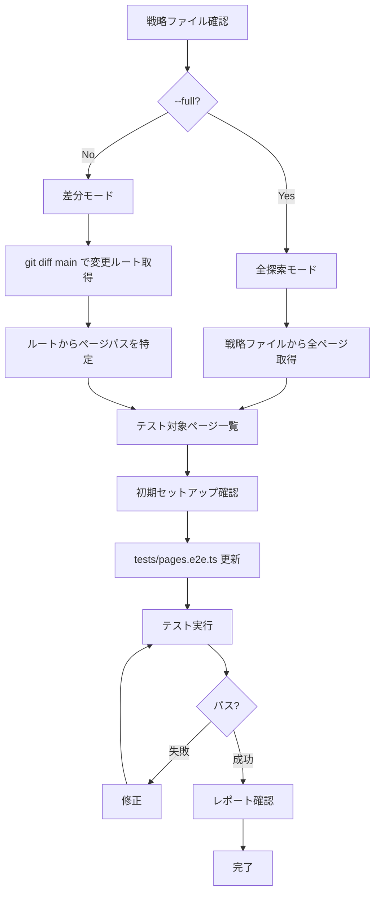

# Test Pages

ページ単位のE2Eテストを作成・実行する。

メインエージェントは司令塔として動作し、実際の作業はサブエージェントに委任する。


## 引数

- `--full` - 全探索モード (戦略ファイルの全ページを対象)
- 引数なし - 差分モード (main ブランチとの差分ページのみ対象)


## フロー図




## 準備: 戦略ファイルを確認

最初に `.claude/strategies/test-pages.md` を確認する。

ファイルが存在しない場合は、以下の手順で作成する:

- サイトマップやルート定義からページ一覧を確認
- AskUserQuestion で対応言語を確認
- 戦略ファイルを作成

戦略ファイルには以下が定義されている:

- 参照ドキュメント (リポジトリごとに設定)
- 対応言語 (リポジトリごとに設定)
- テスト対象ページ一覧
- テスト対象外ページ


## フェーズ1: テスト対象ページを特定


### 差分モード (デフォルト)

main ブランチとの差分からルートファイルを取得する。

```bash
git diff --name-only main -- 'app/routes/**/*.tsx'
```

取得したルートファイルからページパスを特定する。

ルートファイル名からパスへの変換例 (React Router / Remix 形式):

- `_index.tsx` → `/`
- `products._index.tsx` → `/products`
- `products.$handle.tsx` → `/products/$handle` (動的、スキップ)
- `contact.tsx` → `/contact`

動的パラメータを含むページ (`$handle`, `$id` など) はスキップする。

注: ルートファイルの命名規則はフレームワークによって異なる。戦略ファイルで定義されている変換ルールを参照すること。


### 全探索モード (--full)

戦略ファイルのテスト対象ページ一覧を全て対象とする。


## フェーズ2: 初期セットアップ確認


### playwright.config.ts

存在しない場合は作成。`pages` プロジェクトの設定:

- `video: "off"`
- `screenshot: "off"` (フルページスクショは手動で添付)
- `fullyParallel: true`
- `workers: 4` (ローカル) / `2` (CI)
- `reuseExistingServer: true`


### .gitignore

以下のエントリがなければ追加:

```
test-results/
playwright-report/
```


## フェーズ3: テストファイル更新

`tests/pages.e2e.ts` の `PAGES` 配列を更新する。

戦略ファイルの「テスト対象ページ」と「対応言語」を参照してテストを生成する。

```typescript
import { expect, test } from "@playwright/test"

// 戦略ファイル: .claude/strategies/test-pages.md
const PAGES = [
  { name: "home", path: "/" },
  { name: "products", path: "/products" },
  // ... 戦略ファイルを参照
]

// 戦略ファイルの対応言語
const LANGUAGES = ["ja"] as const

for (const page of PAGES) {
  for (const lang of LANGUAGES) {
    const url = lang === "ja" ? page.path : `/${lang}${page.path}`
    const testName = `${page.name}-${lang}`

    test(testName, async ({ page: p }, testInfo) => {
      await p.goto(url, { waitUntil: "domcontentloaded" })
      await expect(p.getByRole("heading", { level: 1 })).toBeVisible()
      await expect(p.locator("footer")).toBeAttached()
      await p.evaluate(() => window.scrollTo(0, document.body.scrollHeight))
      await p.waitForTimeout(2000)
      await p.evaluate(() => window.scrollTo(0, 0))
      const screenshot = await p.screenshot({ fullPage: true })
      await testInfo.attach("fullpage", { body: screenshot, contentType: "image/png" })
    })
  }
}
```


### テストフロー

- ページを開く (`domcontentloaded`)
- h1の表示確認
- フッターがDOMに存在することを確認
- 最下部へスクロール (遅延読み込み対応)
- 2秒待機
- 最上部に戻る
- フルページスクリーンショットをレポートに添付


## フェーズ4: テスト実行


### 差分モード

変更されたページのみテスト:

```bash
bunx playwright test --project=pages -g "page1|page2|page3"
```


### 全探索モード

全ページテスト:

```bash
bunx playwright test --project=pages
```

失敗したテストがあれば修正する。

全テストがパスするまで繰り返す。


## フェーズ5: レポート確認

```bash
bunx playwright show-report
```

各テストをクリックすると「fullpage」添付ファイルとしてフルページスクショが見れる。


## 戦略ファイルの更新

テスト作成中に以下を発見したら `.claude/strategies/test-pages.md` を更新する:

- テスト対象外ページと理由
- 発生した問題 (エラー、ワークアラウンドなど)
